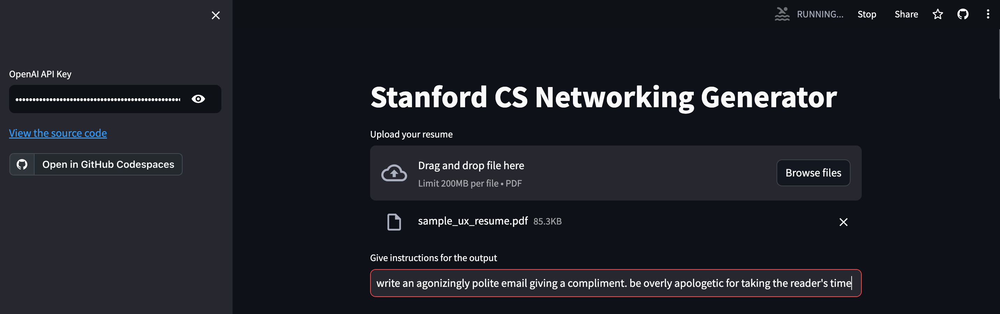
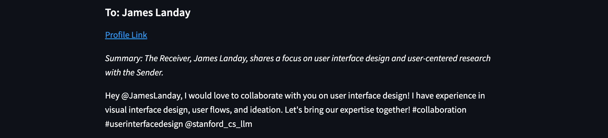

# Stanford CS Networking Generator
 An LLM tool for networking in the Stanford CS community. The tool references a vector database of Stanford Computer Science personal profiles to match your resume/CV with individuals who share your interests and experience. You can instruct the tool to generate text, such as an introductory email or questions to ask them over coffee, for each top matching individual.
 
## Access

### Install and Run Locally
- Create a directory and a new virtual environment for the project
- Clone the project `git clone https://github.com/pcvbjr/stanford-cs-networking-generator.git`
- Install the required packages `pip install -r requirements.txt`
- Run the app `streamlit run app.py`

## Use
- Enter an OpenAI API key in the left side panel
- Upload your resume (PDF)
- Give instructions for the generative output. Write instructions as if prompting a single output - this will be used several times to create multiple outputs to different recipients. Detailed instructions will yield best results.

### Usage Examples
#### **Example 1**
##### **Input**

##### **Output Sample**

#### **Example 2**
##### **Input**

##### **Output Sample**

